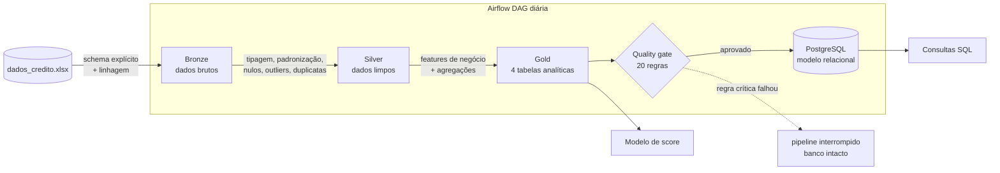
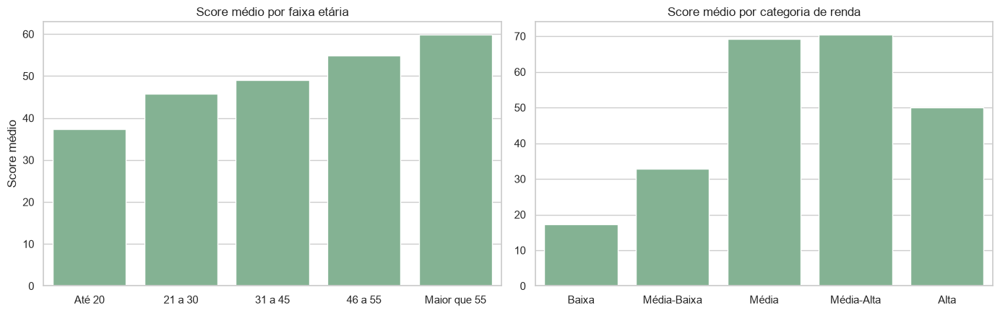
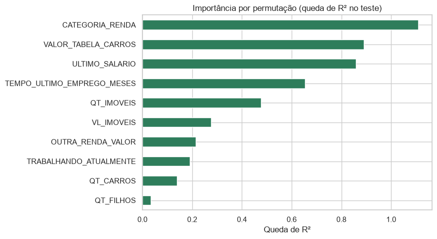

# Pipeline de Dados · Análise de Crédito

[](https://github.com/davidogral/pipeline-analise-credito/actions/workflows/ci.yml)


Pipeline de dados de ponta a ponta para análise de crédito: ingere a base de solicitantes de cartão, trata e valida
os dados em uma **arquitetura medalhão (Bronze → Silver → Gold)**, bloqueia a publicação se as regras de qualidade
falharem, carrega um modelo relacional no **PostgreSQL** e é orquestrado diariamente pelo **Apache Airflow**.
Sobre a camada Gold, consultas SQL analíticas e um modelo de regressão estimam o score de crédito.

> **Duas implementações, mesma arquitetura.** A `main` usa **pandas**. A branch
> [`spark`](https://github.com/davidogral/pipeline-analise-credito/tree/spark) é a primeira versão do projeto e
> implementa o mesmo pipeline em **PySpark** (Spark SQL e `pyspark.ml`), com saídas equivalentes.

## Problema de negócio

A análise manual de crédito é lenta, cara, difícil de escalar e sujeita a erro humano, o que aumenta a exposição a
risco. O objetivo é entregar uma base **confiável, validada e pronta para consumo** que permita avaliar solicitantes
rapidamente: métricas por região, perfil de patrimônio por faixa etária, capacidade de crédito por cliente e um
modelo que estima o score.

## Arquitetura



| Camada | Saída | O que acontece |
| --- | --- | --- |
| **Bronze** | `data/bronze/dados_brutos.csv` | Leitura com schema explícito, marcadores de vazio viram nulo, colunas de linhagem (`DATA_UPLOAD`, `ARQUIVO_FONTE`) |
| **Silver** | `data/silver/dados_limpos.csv` | Tipagem, padronização de texto, "Sim/Não" → booleano, mediana nos salários nulos, outliers de filhos pela moda, deduplicação, `RENDA_TOTAL` |
| **Gold** | `data/gold/*.csv` | Faixa etária, categoria de renda, capacidade de crédito, métricas por UF e patrimônio por faixa etária |
| **Quality** | `data/reports/quality_report.json` | Não nulos, chave única, intervalos válidos, domínio de UF, consistência. Regra crítica falhando interrompe o pipeline |
| **Load** | PostgreSQL | 4 tabelas com PK/FK, publicadas em **uma única transação**: se algo falhar, o banco mantém a última carga válida |

Detalhes de cada coluna, regra e tabela em [`docs/dicionario_de_dados.md`](docs/dicionario_de_dados.md).

## Stack

**Python** (pandas, scikit-learn) · **SQL** (PostgreSQL, SQLite) · **Apache Airflow** (TaskFlow API) ·
**Docker Compose** · **pytest** · **GitHub Actions** · **Ruff** · **PySpark** (branch `spark`)

## Como executar

Pré-requisitos: Python 3.10+ e Docker.

```bash
make install     # cria o .venv e instala o projeto
make run-local   # bronze -> silver -> gold -> quality, sem precisar de banco
make run         # sobe o PostgreSQL no Docker e roda o pipeline completo, com carga
make analytics   # executa as consultas de sql/
make ml          # treina e avalia o modelo de score
make test        # testes unitários e ponta a ponta
```

Sem `make`, os mesmos passos pela CLI:

```bash
pip install -e ".[dev]"
docker compose up -d --wait postgres
credit-pipeline run                          # ou: run --skip-load, run --steps bronze silver
credit-pipeline analytics --engine postgres  # ou --engine sqlite, sem banco
credit-pipeline ml
```

A conexão usa `PGHOST`, `PGPORT`, `PGDATABASE`, `PGUSER` e `PGPASSWORD` (veja [`.env.example`](.env.example)).

### Orquestração com Airflow

```bash
make airflow-up   # Airflow + PostgreSQL em http://localhost:8080 (admin / admin)
```

A DAG [`pipeline_credito`](dags/pipeline_credito.py) roda diariamente `bronze >> silver >> gold >> quality >> load`,
com 2 retries por tarefa. Cada tarefa chama as mesmas funções da CLI, então o que roda no Airflow é exatamente o que
é testado no CI.

## Resultados

**Qualidade:** 20/20 regras aprovadas sobre 10.476 registros, com 100% de completude e unicidade após o tratamento.

**Consultas SQL** ([`sql/`](sql)): CTEs, window functions (`RANK`, `SUM() OVER` com e sem `PARTITION BY`) e agregações.
As mesmas consultas rodam no PostgreSQL e no SQLite, e um teste de integração compara os resultados dos dois motores.

| Consulta | Pergunta respondida |
| --- | --- |
| [`01_visao_geral_por_uf`](sql/01_visao_geral_por_uf.sql) | Como a carteira se distribui entre os estados? |
| [`02_distribuicao_score`](sql/02_distribuicao_score.sql) | Quantos clientes em cada faixa de score, e com que renda? |
| [`03_capacidade_por_uf_e_renda`](sql/03_capacidade_por_uf_e_renda.sql) | Quais segmentos de renda concentram capacidade de crédito em cada UF? |
| [`04_perfil_emprego`](sql/04_perfil_emprego.sql) | Estar empregado muda renda e score? |
| [`05_score_por_patrimonio`](sql/05_score_por_patrimonio.sql) | Patrimônio (imóveis e carros) explica o score? |

**Modelo de score** ([notebook](notebooks/exploracao_e_modelo.ipynb)): regressão linear com R² de **0,92** no
conjunto de teste (MAE de 6,4 pontos numa escala de 0 a 100), contra R² 0 de um baseline que prevê a média.
Features redundantes (`RENDA_TOTAL`, `OUTRA_RENDA`) foram removidas: com elas o R² subia para 0,96, mas o modelo
passava a se apoiar em variáveis colineares que se cancelam, o que tornava a interpretação enganosa.

<p align="center">
  
</p>

A relação entre renda e score **não é linear** (renda *Média-Alta* tem score maior que *Alta*), e por isso a
categoria de renda criada na Gold é a variável mais importante do modelo:

<p align="center">
  
</p>

> A base é didática e tem muitos perfis repetidos, então as métricas do modelo não se transfeririam diretamente
> para dados reais.

## Decisões técnicas

- **Funções puras por camada.** Cada camada expõe uma função `transform`/`build_features` que recebe e devolve um
  DataFrame, sem I/O. Isso permite testar as regras de negócio isoladamente e reaproveitar o mesmo código na CLI,
  no Airflow e no notebook.
- **Quality gate antes da carga.** Dado ruim nunca chega ao banco: a validação roda como etapa própria da DAG e
  interrompe a execução quando uma regra crítica falha.
- **Carga transacional e idempotente.** As tabelas são recriadas dentro de uma transação. Reexecutar o pipeline
  produz o mesmo estado, e uma falha no meio não deixa o banco pela metade.
- **Identificadores seguros.** O SQL dinâmico da carga é montado com `psycopg2.sql.Identifier`, sem concatenar
  nomes de tabelas e colunas.
- **SQL portável.** As consultas analíticas ficam em arquivos `.sql` versionados e rodam em PostgreSQL e SQLite.
- **Configuração por ambiente.** Nenhum caminho ou credencial fixo no código: tudo vem de variáveis de ambiente
  com defaults para desenvolvimento local.

## Estrutura do repositório

```
├── src/credit_pipeline/     # pacote Python
│   ├── bronze.py            # ingestão com schema explícito
│   ├── silver.py            # limpeza e padronização
│   ├── gold.py              # features de negócio e agregações
│   ├── quality.py           # regras de qualidade e quality gate
│   ├── load.py / db.py      # carga transacional no PostgreSQL
│   ├── analytics.py         # executor das consultas de sql/
│   ├── ml.py                # modelo de score
│   └── cli.py               # CLI `credit-pipeline`
├── dags/                    # DAG do Airflow
├── sql/                     # consultas analíticas
├── notebooks/               # exploração e modelo, com saídas renderizadas
├── tests/                   # pytest: unitários, ponta a ponta e integração com PostgreSQL
├── docs/                    # dicionário de dados e imagens
├── data/raw/                # arquivo de origem (as demais camadas são geradas)
├── docker-compose.yml       # PostgreSQL + Airflow
└── .github/workflows/ci.yml # lint, testes e pipeline completo a cada push
```

## Próximos passos

- Migrar o armazenamento das camadas para **Delta Lake** / Parquet e rodar a versão PySpark no **Databricks**.
- Carga incremental (upsert por `CODIGO_CLIENTE`) em vez de recriar as tabelas.
- Monitoramento de drift e retreino do modelo, com validação cruzada e um modelo não linear.

## Autoria

Projeto final (fase 3) desenvolvido em grupo por
[Davi Specia](https://github.com/davidogral),
[Tainá Dreissig](https://github.com/TainaDr),
[Victor de Oliveira](https://github.com/VictorOliveiraIbarrola),
[Alvaro Koene Henning](https://github.com/Alvaro-KHg) e
Bruno Nava Mainardi.
A reestruturação para esta versão (pacote Python, quality gate, carga transacional, testes, CI e Docker) foi feita
por Davi Specia.
