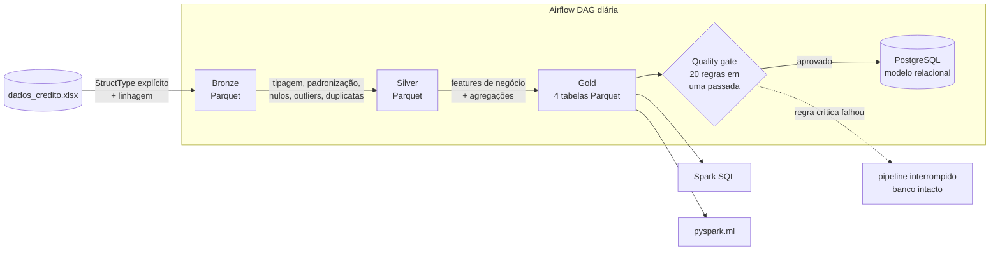
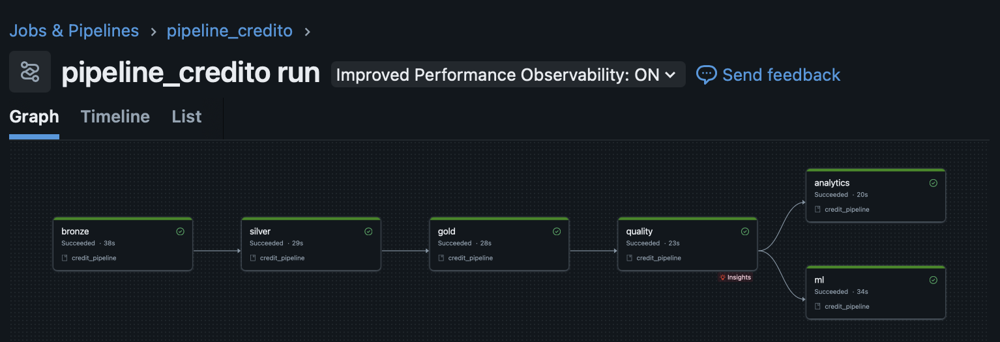
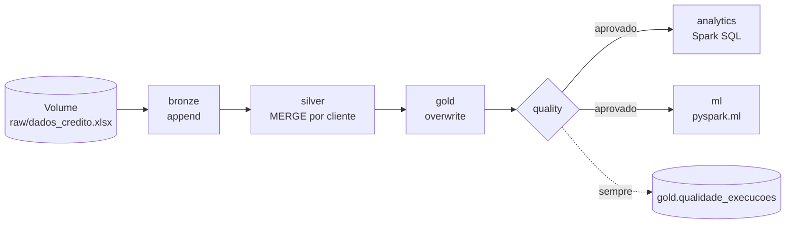
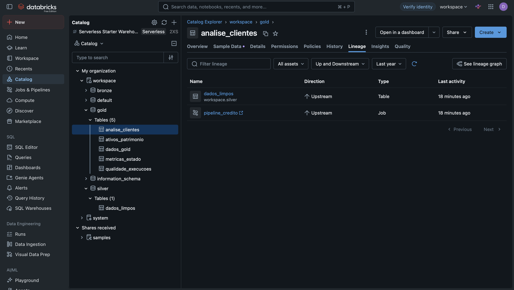
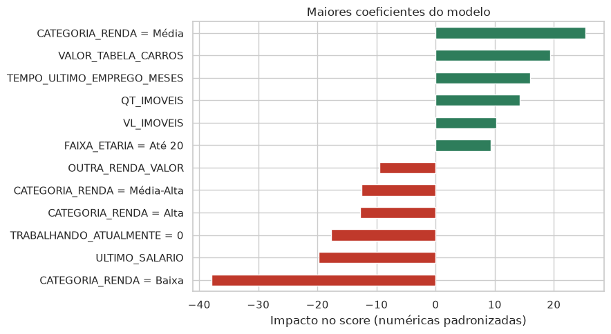

# Pipeline de Dados · Análise de Crédito (PySpark)

[](https://github.com/davidogral/pipeline-analise-credito/actions/workflows/ci.yml)


Pipeline de dados de ponta a ponta para análise de crédito em **PySpark**: ingere a base de solicitantes de cartão,
trata e valida os dados em uma **arquitetura medalhão (Bronze → Silver → Gold)** e bloqueia a publicação se as regras
de qualidade falharem. Sobre a camada Gold, consultas em **Spark SQL** e um modelo **`pyspark.ml`** estimam o score
de crédito.

O mesmo código roda em dois ambientes:

- **Databricks** (serverless): camadas como **tabelas Delta no Unity Catalog**, Bronze com histórico de ingestões,
  Silver atualizada com **`MERGE`**, auditoria de qualidade e um **Job** definido como código (Asset Bundle);
- **Local**: camadas em Parquet, carga num modelo relacional no **PostgreSQL** e orquestração pelo **Apache Airflow**.

> **Esta é a branch `spark`, a primeira versão do projeto.** A mesma arquitetura também está implementada em
> **pandas** na branch [`main`](https://github.com/davidogral/pipeline-analise-credito), com as mesmas regras, as mesmas
> consultas SQL e resultados equivalentes.

## Problema de negócio

A análise manual de crédito é lenta, cara, difícil de escalar e sujeita a erro humano, o que aumenta a exposição a
risco. O objetivo é entregar uma base **confiável, validada e pronta para consumo** que permita avaliar solicitantes
rapidamente: métricas por região, perfil de patrimônio por faixa etária, capacidade de crédito por cliente e um
modelo que estima o score.

## Arquitetura



| Camada | Saída | O que acontece |
| --- | --- | --- |
| **Bronze** | `data/bronze/dados_brutos/` | Leitura com `StructType` explícito, marcadores de vazio viram nulo, colunas de linhagem (`DATA_UPLOAD`, `ARQUIVO_FONTE`) |
| **Silver** | `data/silver/dados_limpos/` | Tipagem, padronização de texto, "Sim/Não" → booleano, mediana nos salários nulos, outliers de filhos pela moda, deduplicação, `RENDA_TOTAL` |
| **Gold** | `data/gold/*/` | Faixa etária, categoria de renda, capacidade de crédito, métricas por UF e patrimônio por faixa etária |
| **Quality** | `data/reports/quality_report.json` | Não nulos, chave única, intervalos válidos, domínio de UF, consistência. Regra crítica falhando interrompe o pipeline |
| **Load** | PostgreSQL | 4 tabelas com PK/FK, publicadas em **uma única transação**: se algo falhar, o banco mantém a última carga válida |

Detalhes de cada coluna, regra e tabela em [`docs/dicionario_de_dados.md`](docs/dicionario_de_dados.md).

## Stack

**Databricks** (Unity Catalog, Delta Lake, Workflows serverless, Asset Bundles) · **PySpark** (DataFrame API,
Spark SQL, `pyspark.ml`) · **SQL** (Spark SQL, PostgreSQL) · **Apache Airflow** (TaskFlow API) · **Docker Compose** ·
**pytest** · **GitHub Actions** · **Ruff**

## Como executar

Pré-requisitos: Python 3.10+, **Java 17** (exigido pelo Spark) e Docker.

```bash
make install     # cria o .venv e instala o projeto
make run-local   # bronze -> silver -> gold -> quality, sem precisar de banco
make run         # sobe o PostgreSQL no Docker e roda o pipeline completo, com carga
make analytics   # executa as consultas de sql/ no Spark SQL
make ml          # treina e avalia o modelo pyspark.ml
make test        # testes unitários e ponta a ponta (SparkSession local)
```

Sem `make`, os mesmos passos pela CLI:

```bash
pip install -e ".[dev]"
docker compose up -d --wait postgres
credit-pipeline run                          # ou: run --skip-load, run --steps bronze silver
credit-pipeline analytics --engine postgres  # ou --engine spark (padrão)
credit-pipeline ml
```

A conexão usa `PGHOST`, `PGPORT`, `PGDATABASE`, `PGUSER` e `PGPASSWORD` (veja [`.env.example`](.env.example)).

### Orquestração com Airflow

```bash
make airflow-up   # Airflow + PostgreSQL em http://localhost:8080 (admin / admin)
```

A imagem do Airflow é estendida com Java 17 ([`docker/airflow.Dockerfile`](docker/airflow.Dockerfile)) para as
tarefas rodarem PySpark. A DAG [`pipeline_credito`](dags/pipeline_credito.py) roda diariamente
`bronze >> silver >> gold >> quality >> load`, com 2 retries por tarefa, chamando as mesmas funções da CLI.

## Rodando no Databricks

O [`databricks.yml`](databricks.yml) é um **Databricks Asset Bundle**: descreve como código os schemas `bronze`,
`silver` e `gold`, o volume com o arquivo de origem e o job `pipeline_credito`, que roda em **compute serverless**
empacotando o projeto como wheel.

<p align="center">
  
</p>



| Tabela no Unity Catalog | Estratégia de escrita | Por quê |
| --- | --- | --- |
| `bronze.dados_brutos` | **append** | Guarda cada ingestão (identificada por `DATA_UPLOAD`); nada do que chegou se perde |
| `silver.dados_limpos` | **`MERGE INTO`** por `CODIGO_CLIENTE` | Fica a versão mais recente de cada cliente: atualiza quem mudou e insere quem é novo |
| `gold.*` | overwrite | Agregações derivadas da Silver inteira |
| `gold.qualidade_execucoes` | append | Resultado de cada regra em cada execução, inclusive as reprovadas: auditoria e tendência de qualidade |

O Unity Catalog registra a linhagem automaticamente: a tabela `gold.analise_clientes` aparece ligada à
`silver.dados_limpos` e ao job que a produziu.

<p align="center">
  
</p>

Como o Delta Lake versiona as tabelas, qualquer carga pode ser inspecionada ou revertida com `DESCRIBE HISTORY` e
`RESTORE TABLE ... TO VERSION AS OF`.

Para publicar no seu workspace (com a [CLI da Databricks](https://docs.databricks.com/dev-tools/cli/) autenticada):

```bash
make databricks-deploy   # bundle deploy + envio do arquivo de origem para o volume
make databricks-run      # executa o job: bronze -> silver -> gold -> quality -> analytics + ml
```

O catálogo padrão é o `workspace`. Para usar outro: `databricks bundle deploy --var catalog=meu_catalogo`.
Localmente, o modo Delta é coberto por um teste que roda o pipeline duas vezes com `delta-spark` e confere o
histórico da Bronze, o `MERGE` da Silver e a auditoria.

## Resultados

**Qualidade:** 20/20 regras aprovadas sobre 10.476 registros, com 100% de completude e unicidade após o tratamento.
As saídas da Gold são idênticas às da versão pandas.

**Databricks:** o job com as 6 tarefas roda com sucesso no compute serverless. Após duas execuções, a Bronze tem
20.952 linhas (2 ingestões), a Silver continua com 10.476 clientes, e a auditoria registra as 20 regras de cada
execução.

**Consultas SQL** ([`sql/`](sql)): CTEs, window functions (`RANK`, `SUM() OVER` com e sem `PARTITION BY`) e
agregações. Os mesmos arquivos `.sql` rodam no Spark SQL (sobre views temporárias das camadas) e no PostgreSQL, e um
teste de integração compara os resultados dos dois motores.

| Consulta | Pergunta respondida |
| --- | --- |
| [`01_visao_geral_por_uf`](sql/01_visao_geral_por_uf.sql) | Como a carteira se distribui entre os estados? |
| [`02_distribuicao_score`](sql/02_distribuicao_score.sql) | Quantos clientes em cada faixa de score, e com que renda? |
| [`03_capacidade_por_uf_e_renda`](sql/03_capacidade_por_uf_e_renda.sql) | Quais segmentos de renda concentram capacidade de crédito em cada UF? |
| [`04_perfil_emprego`](sql/04_perfil_emprego.sql) | Estar empregado muda renda e score? |
| [`05_score_por_patrimonio`](sql/05_score_por_patrimonio.sql) | Patrimônio (imóveis e carros) explica o score? |

**Modelo de score** ([notebook](notebooks/exploracao_e_modelo.ipynb)): pipeline `pyspark.ml` com `StringIndexer`,
`OneHotEncoder`, `StandardScaler` e `LinearRegression`. R² de **0,92** no conjunto de teste (MAE de 6,4 pontos numa
escala de 0 a 100), contra R² 0 de um baseline que prevê a média. Features redundantes (`RENDA_TOTAL`,
`OUTRA_RENDA`) foram removidas para que os coeficientes sejam interpretáveis.

<p align="center">
  
</p>

A relação entre renda e score **não é linear** (renda *Média-Alta* tem score maior que *Alta*), e por isso a
categoria de renda criada na Gold aparece entre os maiores coeficientes do modelo:

<p align="center">
  
</p>

> A base é didática e tem muitos perfis repetidos, então as métricas do modelo não se transfeririam diretamente
> para dados reais.

## Decisões técnicas

- **Um código, dois destinos.** A leitura e a escrita das camadas ficam isoladas em [`io.py`](src/credit_pipeline/io.py):
  a mesma lógica grava Parquet localmente ou tabelas Delta no Unity Catalog, escolhido por `--storage`.
- **Dependências pensadas para o serverless.** PySpark e o driver do PostgreSQL ficam em extras do pacote: o
  Databricks já fornece o Spark, e o `psycopg2-binary` (que embute o próprio OpenSSL) derruba o processo Python
  no ambiente serverless.
- **Quality gate em uma única passada.** As 20 regras viram expressões de agregação avaliadas em um só `agg()`,
  em vez de um `count()` por regra, que varreria os dados dezenas de vezes.
- **Cache e particionamento conscientes.** Localmente, a Gold é cacheada porque alimenta três agregações (no
  serverless, que não permite cache, o passo é ignorado); as agregações pequenas são gravadas com `coalesce(1)`
  para não gerar dezenas de arquivos minúsculos.
- **Funções puras por camada.** Cada camada expõe `transform`/`build_features` (DataFrame → DataFrame), testadas
  com uma `SparkSession` local e reaproveitadas na CLI, no Airflow e no notebook.
- **Carga transacional e idempotente.** As tabelas (~10 mil linhas) são coletadas via Arrow e publicadas numa única
  transação com PK/FK. Para volumes maiores, o caminho seria o conector JDBC do Spark escrevendo em tabelas de staging.
- **SQL portável.** As consultas ficam em arquivos `.sql` versionados, executados no Spark SQL e no PostgreSQL.
- **Configuração por ambiente.** Nenhum caminho ou credencial fixo no código.

## Estrutura do repositório

```
├── src/credit_pipeline/     # pacote Python
│   ├── spark.py             # SparkSession configurada
│   ├── bronze.py            # ingestão com StructType explícito
│   ├── silver.py            # limpeza e padronização
│   ├── gold.py              # features de negócio e agregações
│   ├── quality.py           # regras de qualidade e quality gate
│   ├── load.py / db.py      # carga transacional no PostgreSQL
│   ├── analytics.py         # executor das consultas de sql/ (Spark SQL ou PostgreSQL)
│   ├── ml.py                # modelo pyspark.ml
│   └── cli.py               # CLI `credit-pipeline`
├── databricks.yml           # Asset Bundle: schemas, volume e job serverless
├── dags/                    # DAG do Airflow
├── docker/                  # imagem do Airflow com Java
├── sql/                     # consultas analíticas
├── notebooks/               # exploração e modelo, com saídas renderizadas
├── tests/                   # pytest: unitários, ponta a ponta e integração com PostgreSQL
├── docs/                    # dicionário de dados e imagens
├── data/raw/                # arquivo de origem (as demais camadas são geradas)
├── docker-compose.yml       # PostgreSQL + Airflow
└── .github/workflows/ci.yml # lint, testes e pipeline completo a cada push
```

## Próximos passos

- Ingestão incremental de novos arquivos com **Auto Loader** e regras de qualidade como *expectations* em
  **Lakeflow Declarative Pipelines**.
- Registrar o modelo e as métricas no **MLflow**.
- `CrossValidator` e um modelo não linear (`GBTRegressor`), com monitoramento de drift.

## Autoria

Projeto final (fase 3) desenvolvido em grupo por
[Davi Specia](https://github.com/davidogral),
[Tainá Dreissig](https://github.com/TainaDr),
[Victor de Oliveira](https://github.com/VictorOliveiraIbarrola),
[Alvaro Koene Henning](https://github.com/Alvaro-KHg) e
Bruno Nava Mainardi.
A reestruturação para esta versão (pacote Python, quality gate, carga transacional, testes, CI e Docker) foi feita
por Davi Specia.
